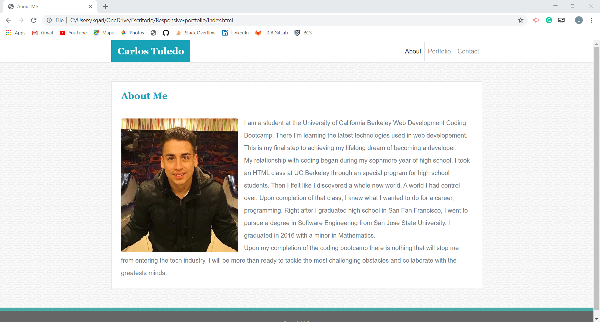
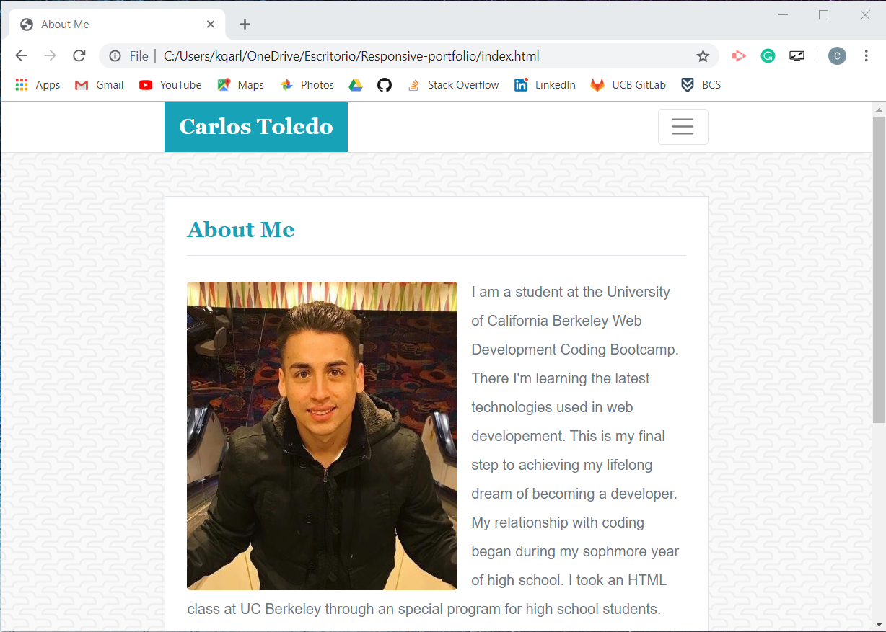
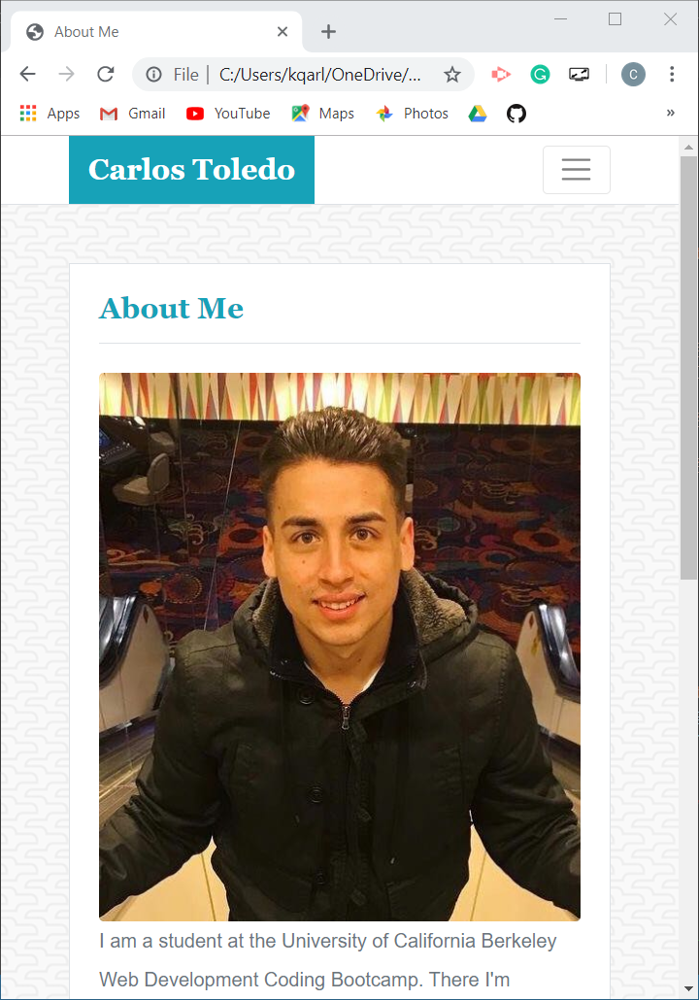
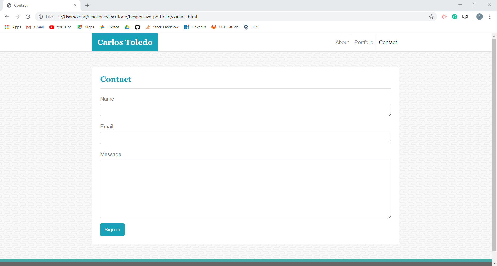
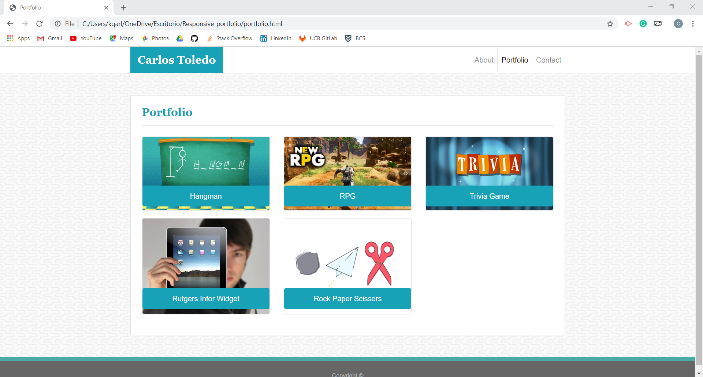
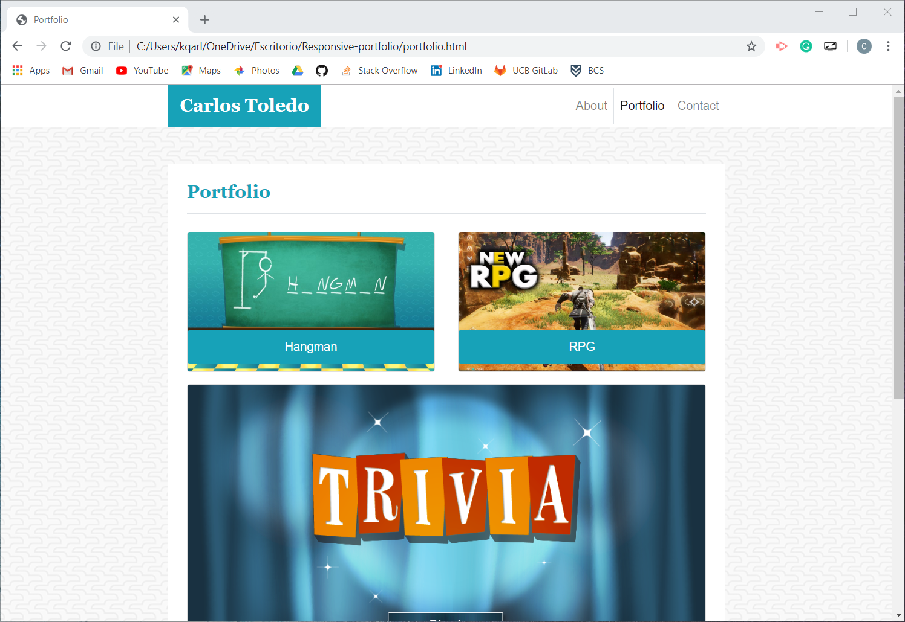
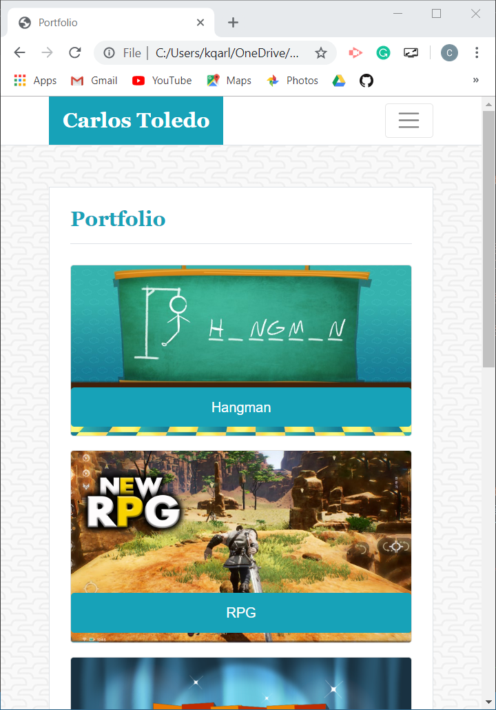
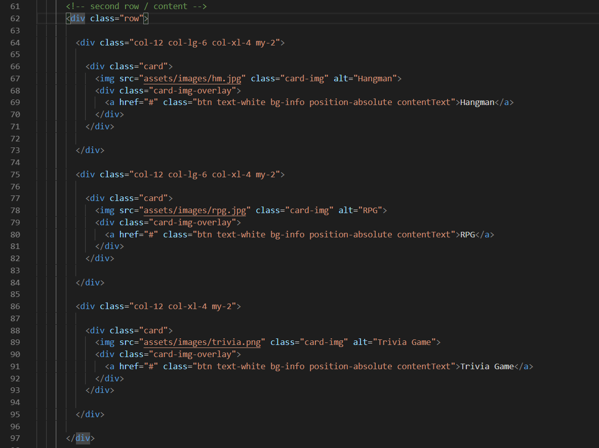

# Responsive-portfolio

This website contain professional information about me and show some of the projects that I have worked on.

## Getting Started

This document contains information on the code writen for the Responsive-Portfolio website. It has explained snippets of code for reference. It also includes links to the live site, the repository on Github and references.

## Site Picture

About Me in large screen

About Me in medium screen : 
* Navigation bar collapses

About Me in small screen
* Width takes a higher percentage.
* Images takes full width of container

Contact page

Portfolio in large screen
* Project cards in 2x3 table

Portfolio in medium screen
* Project cards collapse into a row of two followed by a row of one and back to a rwo of two.

Portfolio in small screen
* Project cards stack

## Code Snippets

This code snippet had an example of a row from the Bootstrap grid system used in the Portfolio page. The column &lt;div class="col-12 col-lg-6 col-xl-4 my-2"&gt; includes the Bootstrap styling necessary to make the project cards responsive to three different browser dimensions. Each project card takes 4 columns at xl size, then 6 columns at lg size and all 12 columns at smaller sizes.

## Built With

* [HTML](https://developer.mozilla.org/en-US/docs/Web/HTML)
* [CSS](https://developer.mozilla.org/en-US/docs/Web/CSS)
* [Bootstrap](https://getbootstrap.com/)

## Deployed Link

* [See Live Site](https://kqarlos.github.io/Responsive-portfolio/index.html)

## Authors

* **Carlos Toledo** 

- [Link to Responsive Portfolio Site](https://github.com/kqarlos/responsive-portfolio)
- [Link to Github](https://www.github.com/kqarlos)
- [Link to LinkedIn](https://www.linkedin.com/in/carlos-toledo415/)

## Acknowledgments

* [W3 Schools](https://www.w3schools.com/)
* [CSS Tricks](https://css-tricks.com/couple-takes-sticky-footer/)