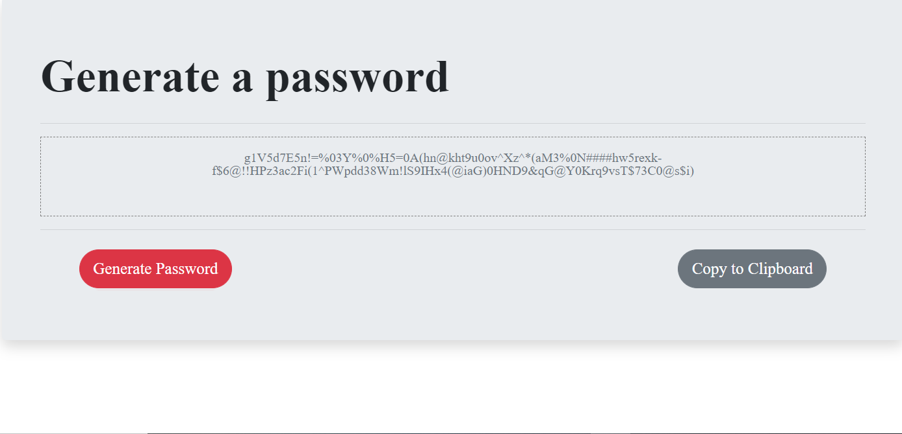

# Portfolio

This website contains my professional informationshows some of the projects that I have worked on.

## Getting Started

This application is compatible with the most commonly used web browsers.

## Site Picture

About Me:
 * Navigation bar collapses
 * Content width takes a higher percentage.
 * Headshot image takes full width of container on mobile screen


Contact page


Portfolio page
* Project cards in 2x3 table.
* Project cards stack in single cards for mobile screens


## Code Snippets

Portfolio Row code

```html

      <!-- second row / content -->
      <div class="row">

        <div class="col-12 col-lg-6 col-xl-4 my-2">

          <div class="card">
            
            <div class="card-img-overlay">
              <a href="https://kqarlos.github.io/code-quiz/" target="_blank"
                class="btn text-white bg-info position-absolute contentText">Code Quiz</a>
            </div>
          </div>

        </div>

        <div class="col-12 col-lg-6 col-xl-4 my-2">

          <div class="card">
            
            <div class="card-img-overlay">
              <a href="https://kqarlos.github.io/password-generator/" target="_blank"
                class="btn text-white bg-info position-absolute contentText">Password Generator</a>
            </div>
          </div>

        </div>

        <div class="col-12 col-lg-6 col-xl-4 my-2">

          <div class="card">
            
            <div class="card-img-overlay">
              <a href="https://kqarlos.github.io/day-planner/" target="_blank"
                class="btn text-white bg-info position-absolute contentText">Day Planner</a>
            </div>
          </div>

        </div>

      </div>

```


* This code snippet had an example of a row from the Bootstrap grid system used in the Portfolio page. The column &lt;div class="col-12 col-lg-6 col-xl-4 my-2"&gt; includes the Bootstrap styling necessary to make the project cards responsive to three different browser dimensions. Each project card takes 4 columns at xl size, then 6 columns at lg size and all 12 columns at smaller sizes.

Navigation Bar code 

```html

  <!-- nav bar -->

  <nav class="p-0 navbar navbar-expand-lg navbar-light">
    <a class="navbar-brand bg-info text-white font-weight-bold p-3 headingText" href="#">Carlos Toledo</a>
    <button class="navbar-toggler" type="button" data-toggle="collapse" data-target="#navbarText"
      aria-controls="navbarText" aria-expanded="false" aria-label="Toggle navigation">
      <span class="navbar-toggler-icon"></span>
    </button>
    <div class="collapse navbar-collapse" id="navbarText">
      <ul class="navbar-nav ml-auto contentText">
        <li class="nav-item active border-right">
          <a class="nav-link" href="index.html">About<span class="sr-only">(current)</span></a>
        </li>
        <li class="nav-item border-right">
          <a class="nav-link" href="portfolio.html">Portfolio</a>
        </li>
        <li class="nav-item">
          <a class="nav-link" href="contact.html">Contact</a>
        </li>
      </ul>
    </div>
  </nav>

  <!-- end nav-bar -->

```

* This shows the code used to create the navigation bar using a Bootstrap Navbar. Here we can see how adding different classes to objects will affect everything from their color to their positioning. In addition, to formatting the objects through Bootstrap's styling, I can also add my own css styling as is shown. For example, &lt;ul class="navbar-nav ml-auto contentText"&gt; uses Bootstrap styling like _ml-auto_ which adjust the list to the rigth. It also uses my own styling _contentText_ which tells it the font type and spacing between lines for the text in the list.

## Built With

* [HTML](https://developer.mozilla.org/en-US/docs/Web/HTML)
* [CSS](https://developer.mozilla.org/en-US/docs/Web/CSS)
* [Bootstrap](https://getbootstrap.com/)
* [Javascript](https://www.javascript.com/)

## Deployed Link

* [See Live Site](https://kqarlos.github.io/Responsive-portfolio/index.html)

## Author

* **Carlos Toledo** 

## Links
- [Link to Responsive Portfolio Site](https://github.com/kqarlos/responsive-portfolio)
- [Link to Github](https://www.github.com/kqarlos)
- [Link to LinkedIn](https://www.linkedin.com/in/carlos-toledo415/)


## Acknowledgments

* [W3 Schools](https://www.w3schools.com/)
* [Bootstrap components](https://getbootstrap.com/docs/4.4/components/navbar/)
* [MDN Web Docs](https://developer.mozilla.org/en-US/docs/Web/API/Document_Object_Model)